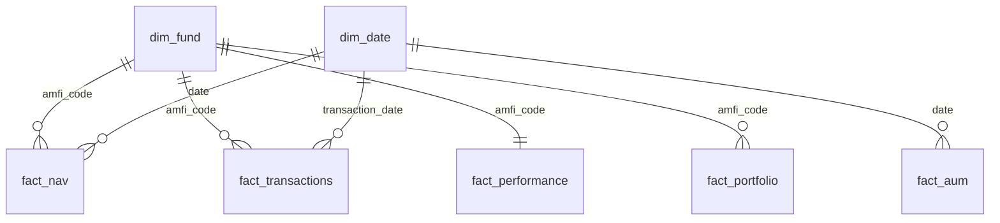

# Bluestock Mutual Fund Analytics Platform 📈
### End-to-End Data Engineering, ETL Pipeline & Interactive Business Intelligence Dashboard
**Prepared by:** Intern / Data Analyst — Bluestock Fintech  
**Date:** June 2026  
**Version:** v1.0 (Production Release)  

Welcome to the production-ready **Mutual Fund Analytics Platform** repository. This platform ingests historical and live mutual fund data from public sources (AMFI India, NSE, mfapi.in), transforms it through a robust Python ETL pipeline, loads it into a normalized SQLite relational star schema database, computes quantitative risk-adjusted performance indicators, and serves interactive insights via a Power BI business intelligence dashboard.

---

## 📁 Repository Structure

The monorepo has been cleaned and consolidated from daily progressive staging directories into a standard production layout:

```text
bluestock_mf_capstone/
│
├── data/
│   ├── raw/                  <- Raw CSV source datasets (01_fund_master.csv to 10_benchmark_indices.csv)
│   ├── processed/            <- Preprocessed, cleaned, and forward-filled CSVs
│   └── db/                   <- Production SQLite database (bluestock_mf.db)
│
├── notebooks/                <- Relational research and analytical notebooks
│   ├── 03_eda_analysis.ipynb          <- Exploratory Data Analysis (EDA) notebook
│   ├── 04_performance_analytics.ipynb  <- Volatility and CAGR calculations
│   └── 05_advanced_analytics.ipynb     <- Advanced risk metrics (VaR, CVaR, HHI, Cohorts)
│
├── scripts/                  <- Pipeline modules and document generators
│   ├── live_nav_fetch.py     <- Ingests daily NAVs for 6 schemes from mfapi.in API
│   ├── etl_pipeline.py       <- Preprocesses raw CSVs, executes DDL, and populates SQLite
│   ├── compute_metrics.py    <- Calculates performance, risk (Sharpe, Sortino, VaR, CVaR), and portfolio HHI
│   ├── recommender.py        <- CLI fund recommendation tool based on risk appetite
│   ├── generate_report.py    <- ReportLab generator compiling the 19-page final PDF report
│   └── generate_presentation.py <- python-pptx generator compiling the 12-slide presentation deck
│
├── sql/                      <- Relational database scripts
│   ├── schema.sql            <- Relational DDL tables and index structures
│   └── queries.sql           <- 10 core analytical business queries
│
├── dashboard/                <- Business Intelligence assets
│   ├── bluestock_mf_dashboard.pbip <- Power BI Desktop project descriptor
│   └── page_1.png to page_4.png <- Visual screenshots of the dashboard pages
│
├── reports/                  <- Final analytical outputs and presentations
│   ├── Final_Report.pdf      <- Final comprehensive 19-page analytical report
│   ├── Bluestock_MF_Presentation.pptx <- 12-slide presentation slide deck
│   └── charts/               <- Generated matplotlib/seaborn charts embedded in reports
│
├── run_pipeline.py           <- Master platform orchestrator
├── requirements.txt            <- Consolidated project python dependencies
└── README.md                 <- System documentation (You are here)
```

---

## 🚀 Installation & Setup Instructions

### 1. Clone the Repository
```bash
git clone https://github.com/Solohunter15/bluestock-mutual-fund-analytics.git
cd bluestock-mutual-fund-analytics
```

### 2. Install Python Dependencies
Ensure you have Python 3.10+ installed. Install the platform dependencies via pip:
```bash
pip install -r requirements.txt
pip install reportlab python-pptx
```

### 3. Run the Master Orchestration Pipeline
Execute the master pipeline runner script to run the entire data engineering and quantitative analytics suite end-to-end:
```bash
python run_pipeline.py
```
This single command triggers the following phases:
1. **Live NAV Ingestion:** Fetches real-time NAV datasets for 6 major schemes from `mfapi.in` and saves raw responses.
2. **ETL Preprocessing:** Standardizes dates, cleans types, forward-fills weekend/holiday gaps, and builds the relational tables in `data/db/bluestock_mf.db` after executing the DDL scripts.
3. **Performance Calculations:** Computes CAGR, risk ratios (Sharpe, Sortino), OLS regression (Alpha, Beta), downside risk (Value at Risk, CVaR), and sector portfolio HHI. Updates `fact_performance` table in the database and writes processed CSV reports and charts.
4. **Recommender CLI:** Executes a verification test run recommending top funds for a Moderate risk appetite.

---

## 🔍 Running the Tools Independently

### Run the Fund Recommender CLI Tool
```bash
python scripts/recommender.py [low/moderate/high]
```
If no arguments are provided, it will launch an interactive command prompt.

### Compile the 19-Page Final PDF Report
```bash
python scripts/generate_report.py
```
Outputs the professional final PDF report to `reports/Final_Report.pdf`.

### Compile the 12-Slide PowerPoint Presentation
```bash
python scripts/generate_presentation.py
```
Outputs the slide deck to `reports/Bluestock_MF_Presentation.pptx`.

---

## 📊 Relational Database Schema Design (Star Schema)

The SQLite database `data/db/bluestock_mf.db` features a normalized star schema:



### Table Registry
*   **`dim_fund` (Dimension):** Static details of 40 schemes (AMFI codes, AMC, category, plans, expense ratio, manager, risk category).
*   **`dim_date` (Dimension):** Pre-populated date dimensions (2022-2026 calendar mapping year, quarter, month, and weekday status).
*   **`fact_nav` (Fact):** Daily historical NAVs and daily returns, reindexed and forward-filled, and aligned with market trading days.
*   **`fact_transactions` (Fact):** 32,778 transaction logs (SIP, lumpsum, redemptions) for 5,000 investors with demographic metrics (age, gender, state, city tier).
*   **`fact_performance` (Fact):** Risk-adjusted statistics, CAGR periods, Sharpe, Sortino, Alpha, Beta, Max Drawdowns, and ratings.
*   **`fact_portfolio` (Fact):** Top equity holdings weight percentages and sectors as of December 2025.
*   **`fact_aum` (Fact):** Quarterly assets (Rs. crore) for the top 10 AMCs.
*   **`fact_sip_industry` (Fact):** Monthly industry SIP inflows, active accounts, and YoY growth.

---

## 💡 Key Business & Financial Takeaways

1.  **SIP Continuity & Churn Vulnerability:** SIP continuity analysis on investors with 6+ SIP transactions reveals that **97.80% (1,332 investors)** have average transaction gaps exceeding **35 days**. The global average gap stands at **64.89 days**, double the standard 30-day billing cycle. This points to irregular savings behavior, highlighting the need for automated mandate validation and notifications.
2.  **Sector Concentration Risk (HHI):** Sector Herfindahl-Hirschman Index (HHI) rankings reveal that Large Cap portfolios exhibit higher sector concentration. **Axis Bluechip Fund (Regular)** is the most concentrated portfolio with a sector HHI of **2,967.69** across only 7 sectors. **UTI Mid Cap Fund (Regular)** represents the most diversified equity portfolio with an HHI of **1,240.20** across 10 sectors.
3.  **Downside Risk Profiles (VaR/CVaR):** Small Cap funds exhibited the highest downside exposure. **SBI Small Cap Fund (Direct)** and **Axis Small Cap Fund (Regular)** show the highest daily Historical VaR (95%) of approximately **-2.52%** and **-2.43%** respectively. In the worst 5% of trading days, the average daily loss (CVaR) increases to **-3.23%**. Debt and Liquid funds remain stable with daily VaR of **-0.08%** and CVaR of **-0.10%**.
4.  **Investor Cohort Expansion:** The **2024 cohort** comprises 4,803 investors contributing a gross investment of **Rs. 225.8 crore** (Net: Rs. 102.5 crore). The **2025 cohort** is smaller (197 investors) contributing **Rs. 1.90 crore** (Net: Rs. 0.75 crore). However, the average monthly SIP amount for the 2025 cohort is **Rs. 13,505.21**, which represents a **22.8% increase** compared to the 2024 cohort's average of **Rs. 10,996.89**, showing that newer cohorts commit larger ticket sizes.
5.  **Scorecard Best Performers:**
    *   **Large Cap Category:** HDFC Top 100 Fund (Regular) leads the moderate-risk category with a Sharpe ratio of **1.06** and a 3-Year CAGR of **14.84%**.
    *   **Mid Cap Category:** Kotak Emerging Equity Fund (Regular) leads the high-risk category with a Sharpe ratio of **0.96** and a 3-Year CAGR of **18.23%**.
    *   **Small Cap Category:** SBI Small Cap Fund (Direct) leads with a 3-Year CAGR of **23.14%** but exhibits higher volatility.
